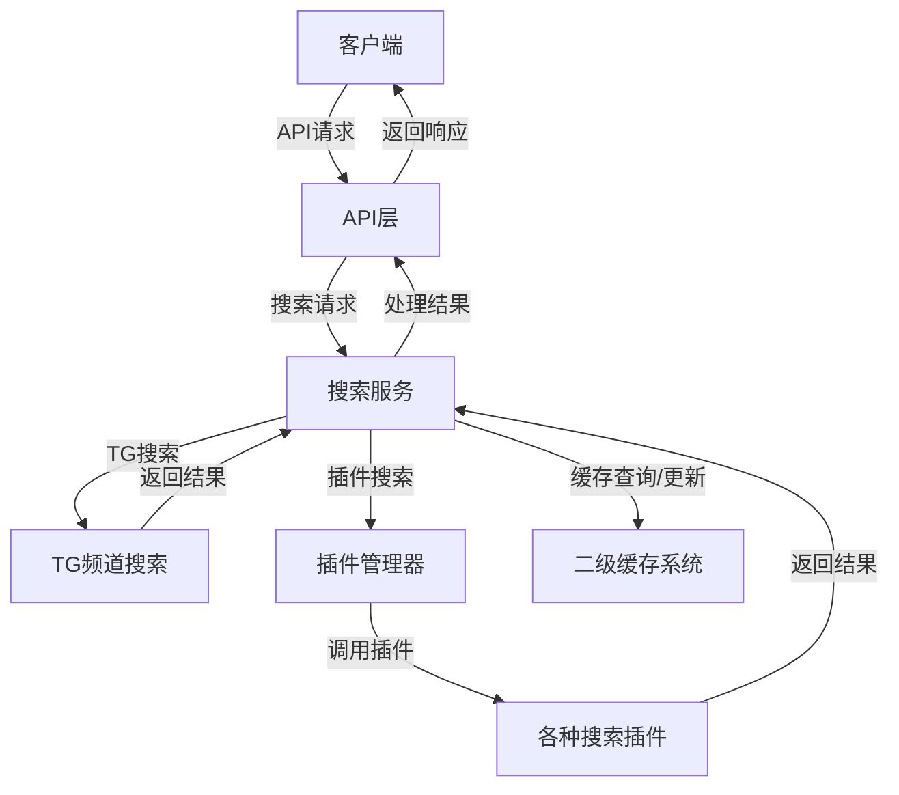

# PanSou 项目 Code Wiki

## 1. 项目概览

PanSou是一个高性能的网盘资源搜索API服务，支持TG搜索和自定义插件搜索。系统设计以性能和可扩展性为核心，支持并发搜索、结果智能排序和网盘类型分类。

### 主要功能
- **高性能搜索**：并发执行多个TG频道及异步插件搜索，显著提升搜索速度
- **网盘类型分类**：自动识别多种网盘链接，按类型归类展示
- **智能排序**：基于插件等级、时间新鲜度和优先关键词的多维度综合排序算法
- **异步插件系统**：支持通过插件扩展搜索来源，支持"尽快响应，持续处理"的异步搜索模式
- **二级缓存**：分片内存+分片磁盘缓存机制，大幅提升重复查询速度和并发性能

### 支持的网盘类型
百度网盘、阿里云盘、夸克网盘、天翼云盘、UC网盘、移动云盘、115网盘、PikPak、迅雷网盘、123网盘、磁力链接、电驴链接等

## 2. 目录结构

```
├── api/             # API处理层，包含路由和处理函数
├── config/          # 配置管理
├── docs/            # 项目文档
├── example/         # 示例代码
├── frontend/        # 前端代码（Vue.js）
├── model/           # 数据模型定义
├── plugin/          # 插件系统，包含各种搜索插件
├── service/         # 业务逻辑层
├── typescript/      # TypeScript相关代码
├── util/            # 工具函数
├── main.go          # 项目入口
└── go.mod           # Go模块依赖
```

### 核心目录详解

| 目录      | 主要职责                 | 文件位置                     |
|---------|----------------------|--------------------------|
| api     | API路由和请求处理           | [api/](file:///workspace/api) |
| config  | 配置管理和环境变量处理          | [config/](file:///workspace/config) |
| model   | 数据模型定义               | [model/](file:///workspace/model) |
| plugin  | 插件系统和各种搜索插件          | [plugin/](file:///workspace/plugin) |
| service | 搜索服务和业务逻辑            | [service/](file:///workspace/service) |
| util    | 工具函数和缓存实现            | [util/](file:///workspace/util) |

## 3. 系统架构与主流程

PanSou采用分层架构设计，主要分为API层、服务层、插件层和缓存层。系统通过并发处理和异步机制实现高性能搜索。

### 系统架构图



### 主要流程

1. **请求接收**：API层接收客户端搜索请求
2. **参数处理**：解析搜索参数，如关键词、频道、插件等
3. **并发搜索**：
   - 并行搜索多个TG频道
   - 并行调用多个搜索插件
4. **结果处理**：
   - 合并搜索结果
   - 智能排序（基于时间、关键词、插件等级）
   - 按网盘类型分组
5. **缓存处理**：
   - 检查缓存是否命中
   - 更新缓存（异步）
6. **响应返回**：返回格式化的搜索结果

## 4. 核心功能模块

### 4.1 搜索服务

搜索服务是系统的核心，负责协调TG搜索和插件搜索，处理结果合并和排序。

**主要功能**：
- 并发执行多个搜索任务
- 智能合并和排序搜索结果
- 按网盘类型分组结果
- 管理搜索缓存

**关键文件**：[service/search_service.go](file:///workspace/service/search_service.go)

### 4.2 插件系统

插件系统允许扩展搜索来源，支持异步搜索和结果处理。

**主要功能**：
- 插件注册和管理
- 异步搜索执行
- 插件结果缓存
- 支持Web路由的插件

**关键文件**：[plugin/plugin.go](file:///workspace/plugin/plugin.go)

### 4.3 缓存系统

缓存系统采用二级缓存设计，提高搜索性能和并发能力。

**主要功能**：
- 分片内存缓存
- 分片磁盘缓存
- 延迟批量写入
- 缓存过期管理

**关键文件**：[util/cache/](file:///workspace/util/cache/)

### 4.4 API层

API层处理HTTP请求，提供搜索和认证接口。

**主要功能**：
- 处理搜索请求（POST和GET）
- 提供认证接口
- 健康检查
- 插件Web路由注册

**关键文件**：[api/router.go](file:///workspace/api/router.go)

## 5. 核心 API/类/函数

### 5.1 搜索服务

#### SearchService.Search
```go
func (s *SearchService) Search(keyword string, channels []string, concurrency int, forceRefresh bool, resultType string, sourceType string, plugins []string, cloudTypes []string, ext map[string]interface{}) (model.SearchResponse, error)
```

**功能**：执行搜索并返回结果
**参数**：
- keyword: 搜索关键词
- channels: 搜索的TG频道列表
- concurrency: 并发搜索数量
- forceRefresh: 是否强制刷新缓存
- resultType: 结果类型（all/results/merge）
- sourceType: 数据来源类型（all/tg/plugin）
- plugins: 指定搜索的插件列表
- cloudTypes: 指定返回的网盘类型列表
- ext: 扩展参数

**返回值**：搜索响应对象和错误

#### SearchService.searchTG
```go
func (s *SearchService) searchTG(keyword string, channels []string, forceRefresh bool) ([]model.SearchResult, error)
```

**功能**：搜索TG频道
**参数**：
- keyword: 搜索关键词
- channels: 搜索的TG频道列表
- forceRefresh: 是否强制刷新缓存

**返回值**：搜索结果列表和错误

#### SearchService.searchPlugins
```go
func (s *SearchService) searchPlugins(keyword string, plugins []string, forceRefresh bool, concurrency int, ext map[string]interface{}) ([]model.SearchResult, error)
```

**功能**：搜索插件
**参数**：
- keyword: 搜索关键词
- plugins: 指定搜索的插件列表
- forceRefresh: 是否强制刷新缓存
- concurrency: 并发搜索数量
- ext: 扩展参数

**返回值**：搜索结果列表和错误

### 5.2 插件系统

#### BaseAsyncPlugin.AsyncSearch
```go
func (p *BaseAsyncPlugin) AsyncSearch(keyword string, searchFunc func(*http.Client, string, map[string]interface{}) ([]model.SearchResult, error), mainCacheKey string, ext map[string]interface{}) ([]model.SearchResult, error)
```

**功能**：异步执行搜索
**参数**：
- keyword: 搜索关键词
- searchFunc: 搜索函数
- mainCacheKey: 主缓存键
- ext: 扩展参数

**返回值**：搜索结果列表和错误

#### PluginManager.RegisterGlobalPluginsWithFilter
```go
func (pm *PluginManager) RegisterGlobalPluginsWithFilter(enabledPlugins []string)
```

**功能**：根据过滤器注册全局异步插件
**参数**：
- enabledPlugins: 启用的插件列表

### 5.3 API层

#### SetupRouter
```go
func SetupRouter(searchService *service.SearchService) *gin.Engine
```

**功能**：设置API路由
**参数**：
- searchService: 搜索服务实例

**返回值**：Gin引擎实例

#### SearchHandler
```go
func SearchHandler(c *gin.Context)
```

**功能**：处理搜索请求
**参数**：
- c: Gin上下文

## 6. 技术栈与依赖

| 技术/依赖        | 用途                     | 来源                                    |
|-------------|------------------------|---------------------------------------|
| Go          | 后端开发语言                 | [go.mod](file:///workspace/go.mod)     |
| Gin         | HTTP框架                 | [go.mod](file:///workspace/go.mod)     |
| Vue.js      | 前端框架                  | [frontend/package.json](file:///workspace/frontend/package.json) |
| Docker      | 容器化部署                 | [Dockerfile](file:///workspace/Dockerfile) |
| Redis       | 缓存（可选）                | 配置文件                                  |
| JWT         | 认证令牌                  | [util/jwt.go](file:///workspace/util/jwt.go) |

## 7. 配置、部署与开发

### 7.1 环境变量配置

| 环境变量 | 描述 | 默认值 | 说明 |
|---------|------|--------|------|
| PORT | 服务端口 | 8888 | 修改服务监听端口 |
| PROXY | SOCKS5代理 | 无 | 如：PROXY=socks5://127.0.0.1:1080 |
| CHANNELS | 默认搜索的TG频道 | tgsearchers3 | 多个频道用逗号分隔 |
| ENABLED_PLUGINS | 指定启用插件 | 无 | 多个插件用逗号分隔 |
| AUTH_ENABLED | 是否启用认证 | false | 设置为true启用认证功能 |
| AUTH_USERS | 用户账号配置 | 无 | 格式：user1:pass1,user2:pass2 |

### 7.2 部署方式

#### Docker部署

**前后端集成版**：
```bash
docker run -d --name pansou -p 80:80 ghcr.io/fish2018/pansou-web
```

**纯后端API版**：
```bash
docker run -d --name pansou -p 8888:8888 ghcr.io/fish2018/pansou:latest
```

#### 从源码安装

1. 克隆仓库
```bash
git clone https://github.com/fish2018/pansou.git
cd pansou
```

2. 构建
```bash
CGO_ENABLED=0 GOOS=linux GOARCH=amd64 go build -ldflags="-s -w -extldflags '-static'" -o pansou .
```

3. 运行
```bash
./pansou
```

## 8. 监控与维护

### 8.1 健康检查

系统提供健康检查接口：
```
GET /api/health
```

返回系统状态、启用的插件和频道信息。

### 8.2 日志

系统日志包括：
- 服务启动信息
- 搜索执行日志
- 缓存操作日志
- 插件执行日志

### 8.3 常见问题

- **搜索结果为空**：检查网络连接、代理设置和插件配置
- **响应缓慢**：增加并发数，检查网络速度
- **内存使用高**：调整缓存大小和GC设置

## 9. 插件开发

### 9.1 插件接口

插件需要实现 `AsyncSearchPlugin` 接口：

```go
type AsyncSearchPlugin interface {
    Name() string
    Priority() int
    AsyncSearch(keyword string, searchFunc func(*http.Client, string, map[string]interface{}) ([]model.SearchResult, error), mainCacheKey string, ext map[string]interface{}) ([]model.SearchResult, error)
    SetMainCacheKey(key string)
    SetCurrentKeyword(keyword string)
    Search(keyword string, ext map[string]interface{}) ([]model.SearchResult, error)
    SkipServiceFilter() bool
}
```

### 9.2 插件注册

在 `main.go` 中添加插件的空导入：

```go
_ "pansou/plugin/yourplugin"
```

### 9.3 插件示例

参考现有插件实现，如：
- [plugin/labi/labi.go](file:///workspace/plugin/labi/labi.go)
- [plugin/zhizhen/zhizhen.go](file:///workspace/plugin/zhizhen/zhizhen.go)

## 10. API 文档

### 10.1 搜索API

**接口地址**：`/api/search`
**请求方法**：`POST` 或 `GET`

**POST请求参数**：

| 参数名 | 类型 | 必填 | 描述 |
|--------|------|------|------|
| kw | string | 是 | 搜索关键词 |
| channels | string[] | 否 | 搜索的频道列表 |
| conc | number | 否 | 并发搜索数量 |
| refresh | boolean | 否 | 强制刷新，不使用缓存 |
| res | string | 否 | 结果类型：all/results/merge |
| src | string | 否 | 数据来源类型：all/tg/plugin |
| plugins | string[] | 否 | 指定搜索的插件列表 |
| cloud_types | string[] | 否 | 指定返回的网盘类型列表 |
| ext | object | 否 | 扩展参数 |
| filter | object | 否 | 过滤配置 |

**响应示例**：

```json
{
  "total": 15,
  "results": [
    {
      "message_id": "12345",
      "unique_id": "channel-12345",
      "channel": "tgsearchers3",
      "datetime": "2023-06-10T14:23:45Z",
      "title": "速度与激情全集1-10",
      "content": "速度与激情系列全集，1080P高清...",
      "links": [
        {
          "type": "baidu",
          "url": "https://pan.baidu.com/s/1abcdef",
          "password": "1234",
          "datetime": "2023-06-10T14:23:45Z",
          "work_title": "速度与激情全集1-10"
        }
      ],
      "tags": ["电影", "合集"],
      "images": [
        "https://cdn1.cdn-telegram.org/file/xxx.jpg"
      ]
    }
  ],
  "merged_by_type": {
    "baidu": [
      {
        "url": "https://pan.baidu.com/s/1abcdef",
        "password": "1234",
        "note": "速度与激情全集1-10",
        "datetime": "2023-06-10T14:23:45Z",
        "source": "tg:频道名称",
        "images": [
          "https://cdn1.cdn-telegram.org/file/xxx.jpg"
        ]
      }
    ]
  }
}
```

### 10.2 认证API

**登录**：`POST /api/auth/login`
**验证**：`POST /api/auth/verify`
**退出**：`POST /api/auth/logout`

## 11. 总结与亮点回顾

PanSou 是一个功能强大、性能优异的网盘搜索API服务，具有以下核心优势：

1. **高性能设计**：通过并发搜索和异步处理，显著提升搜索速度
2. **可扩展性**：插件系统允许轻松添加新的搜索来源
3. **智能排序**：多维度排序算法确保高质量结果优先
4. **高效缓存**：二级缓存机制大幅提升重复查询性能
5. **灵活配置**：丰富的环境变量配置，适应不同部署场景
6. **安全性**：可选的认证系统保护API访问

PanSou 不仅是一个实用的网盘搜索工具，也是学习Go语言并发编程、插件系统设计和缓存优化的优秀案例。通过模块化的设计和精心的性能优化，PanSou 实现了高效、可靠的网盘资源搜索服务。